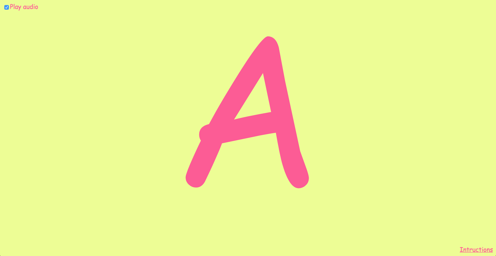
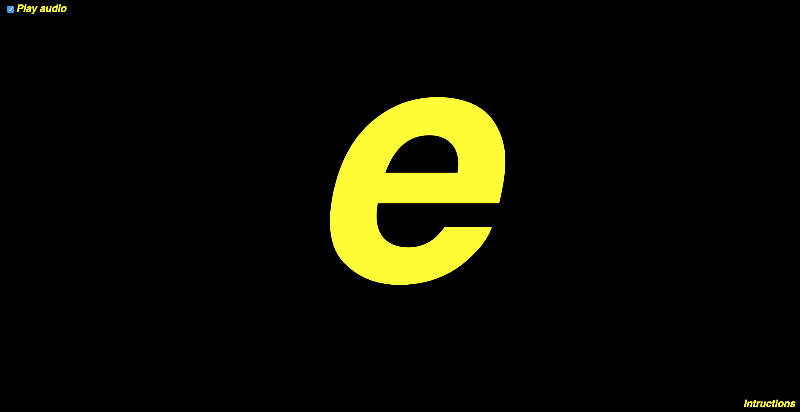

# aaaooo

A child's game where you just see what you type on the screen, in big type.
My 3 year old son loves hammering keys on my laptop when he sees me working on it and seeing the letters change on my text editor. I eventually grew tired of opening a new text editor window, zooming it in to ridiculous levels and making it fullscreen–that's why I created this app.

[Play the game here](https://aaaooo.in/).

If you have any questions you can open an issue or contact me through my [twitter account](https://twitter.com/martzoukos).

## Configuration options
You can configure the display options of the game if you don't like the colors or the, unapologetically selected, Comic Sans typeface.  
Just pass a querystring to the URL, using one of the below options. They accept your typical CSS value, but don't forget to escape that # (convert it to `%23`) if you're setting colors.

| Value        | Querystring           |
| ------------- |-------------| 
| Text color      | `textColor` |
| Background color      | `bgColor`      |
| Font family | `fontFamily`      |
| Font weight | `fontWeight`      |
| Font style | `fontStyle`      |

For example, the url `https://aaaooo.in?textColor=yellow&bgColor=%23000000&fontFamily=Helvetica,sans-serif&fontWeight=800&fontStyle=italic` will result in this:

